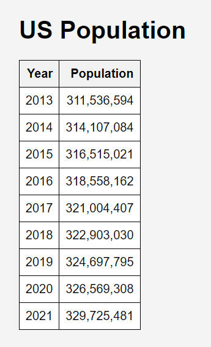
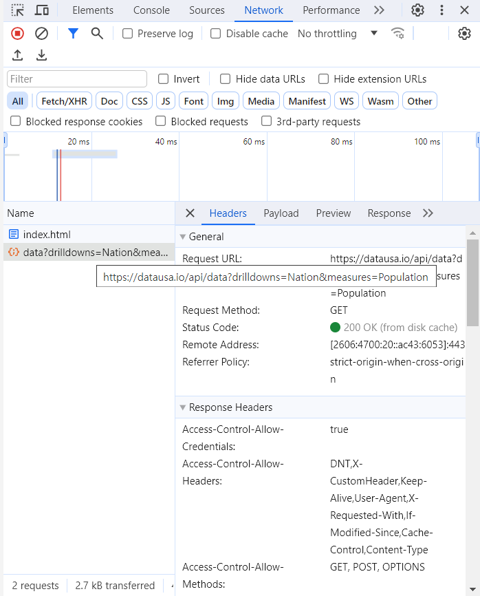

# Assignment-2-API-JSON-HTML-JavaScript
# US Population Data Display

This project is a web application that visualizes US Population data from the [Data USA API](https://datausa.io/api/data?drilldowns=Nation&measures=Population). Upon loading the webpage, the application fetches population data and displays it in a table format sorted by year.

## Repository Contents

- `index.html`: The main HTML document for the web application.
- `screenshots`: Directory containing images of the web page and network activity as seen in the developer tools.

## Web Application Features

- **Data Fetching**: Automatically retrieves US Population data from the Data USA API when the webpage loads.
- **Data Sorting**: The fetched data is sorted by year to ensure chronological display.
- **Responsive Table**: Population data is displayed in a table with a layout that adjusts to different screen sizes.
- **Error Handling**: Includes basic error handling for the API request to inform the user of any issues.

## How to View the Web Application

To view the web application:

1. Clone this repository to your local machine using `git clone [https://github.com/jeongbeom98/Assignment-2-API-JSON-HTML-JavaScript.git]`.
2. Open the `index.html` file in a modern web browser.
3. The US Population data should load and display automatically.

## How to Use the Web Application

- Simply open the `index.html` file in a web browser to view the US Population data table.
- The table will show the year and the corresponding population, sorted by year.

## Screenshots

Below are screenshots depicting the application's interface and the network requests as captured by the browser's developer tools:




## Technical Implementation

### Fetching Data

The following JavaScript snippet demonstrates how the application fetches and processes the population data:

```javascript
document.addEventListener('DOMContentLoaded', function() {
    const apiUrl = 'https://datausa.io/api/data?drilldowns=Nation&measures=Population';
    fetch(apiUrl)
        .then(response => response.json())
        .then(data => {
            // JavaScript code to sort and insert data into the table
        })
        .catch(error => console.error('Error fetching data:', error));
});
```

### Displaying Data

The HTML table is dynamically populated with the data returned from the API using JavaScript DOM manipulation.

## Contact Information

For support or queries, please contact me at [jeongbeom-lee@uiowa.edu].